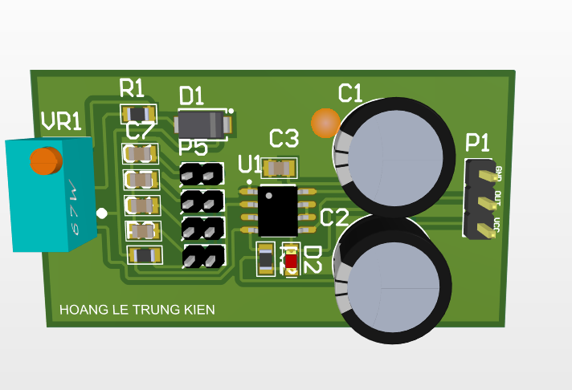

# NE555 Adjustable PWM Square Wave Signal Generator

A simple 555 timer circuit configured as an adjustable frequency oscillator with four filtered output channels for different applications.

## Features

- **Input Voltage:** 5V-15V DC
- **Adjustable Frequency:** Via VR1 (10kΩ potentiometer)
- **4 Output Channels:** Each with different filtering characteristics
- **LED Indicator:** Visual feedback of oscillation
- **Frequency Range:** ~10-100kHz (adjustable)

## Key Components

- **U1 (NE555):** Timer IC in astable mode
- **VR1 (10kΩ):** Frequency control potentiometer
- **R1 (1kΩ), R3 (330Ω):** Timing resistors
- **R2 (2.2kΩ):** LED current limiter
- **C3 (10nF):** Timing capacitor
- **D1 (1N4148):** Signal diode
- **D2:** LED indicator

## Output Channels

- **P2 (102pF filter):** Fast switching - digital circuits
- **P3 (104pF filter):** Medium speed - general purpose
- **P4 (1μF filter):** Moderate filtering - analog apps
- **P5 (100μF filter):** Heavy filtering - DC/relay driving

## Pin Connections

- **P2-P5:** Output headers (Signal + GND)
- **VCC/GND:** Power supply input

## Board Layout

## Applications

- LED flasher with variable speed
- Clock signal generator
- Audio tone generator
- PWM signal source
- Multi-speed timer

## Usage

1. Connect 5-15V power supply
2. Adjust VR1 to change frequency
3. Select output channel based on filtering needs
4. LED blinks at output frequency

**Version:** 1.0
